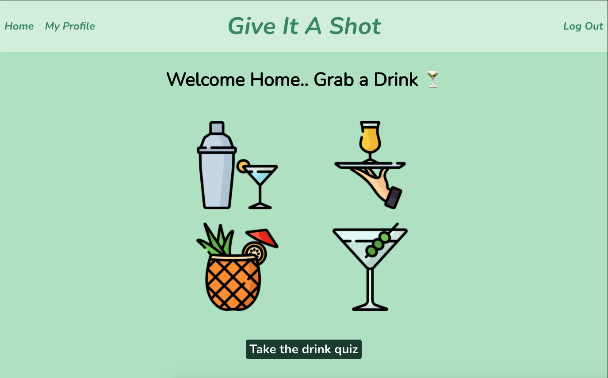
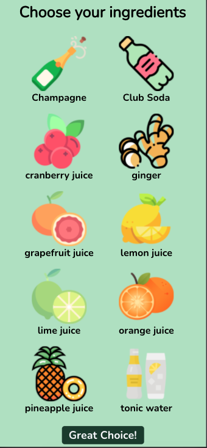
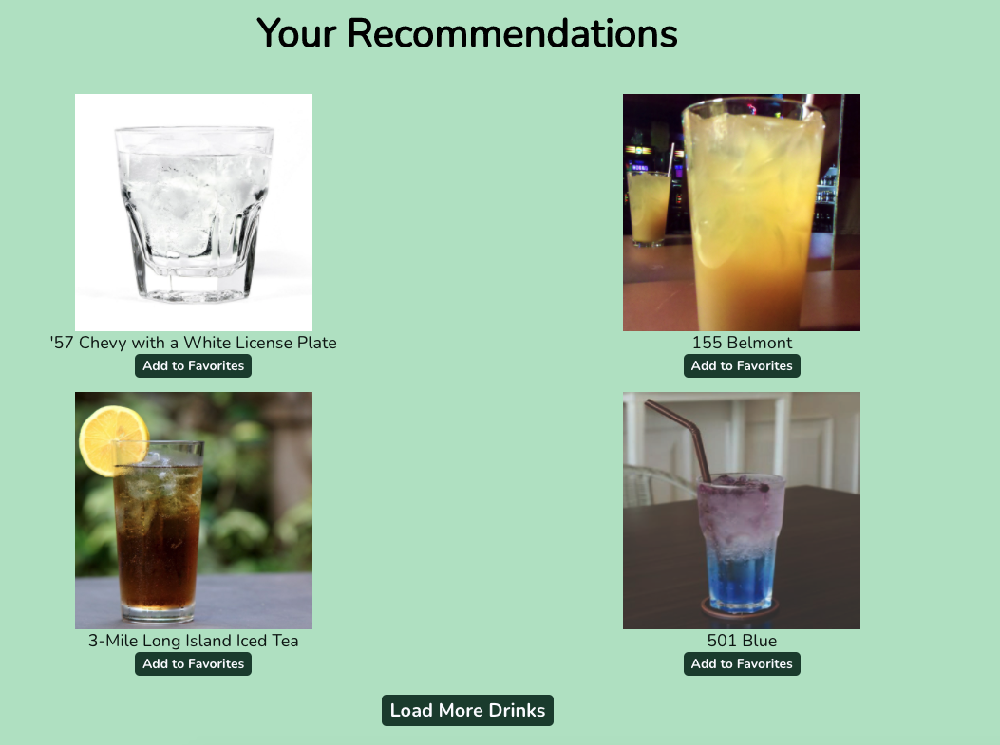
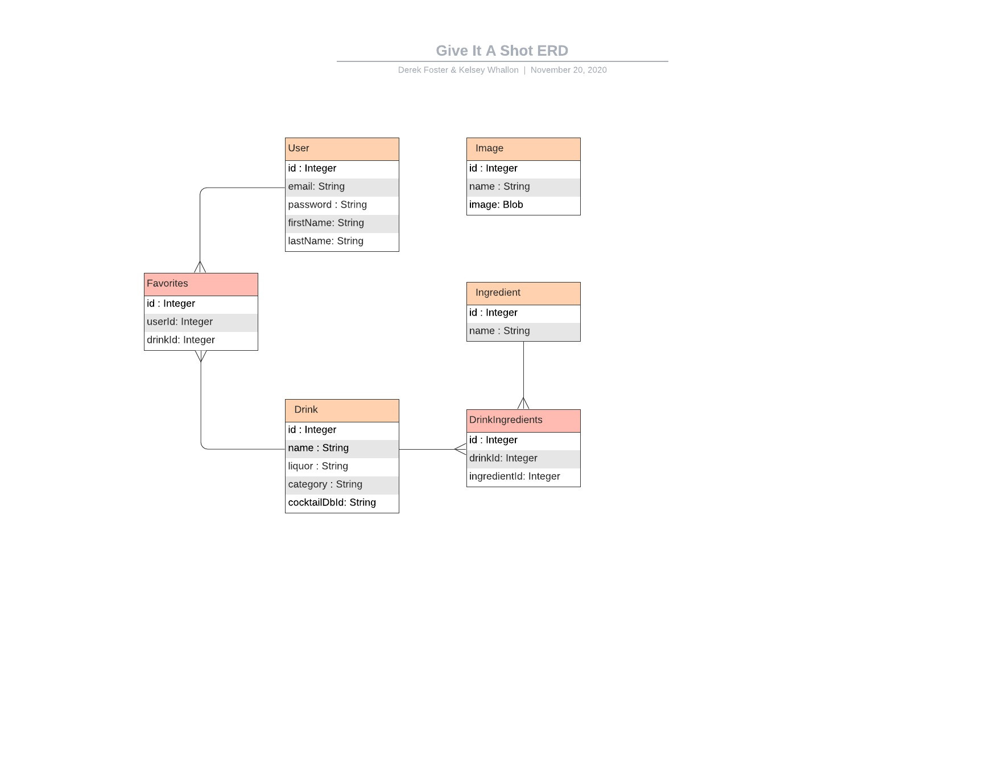
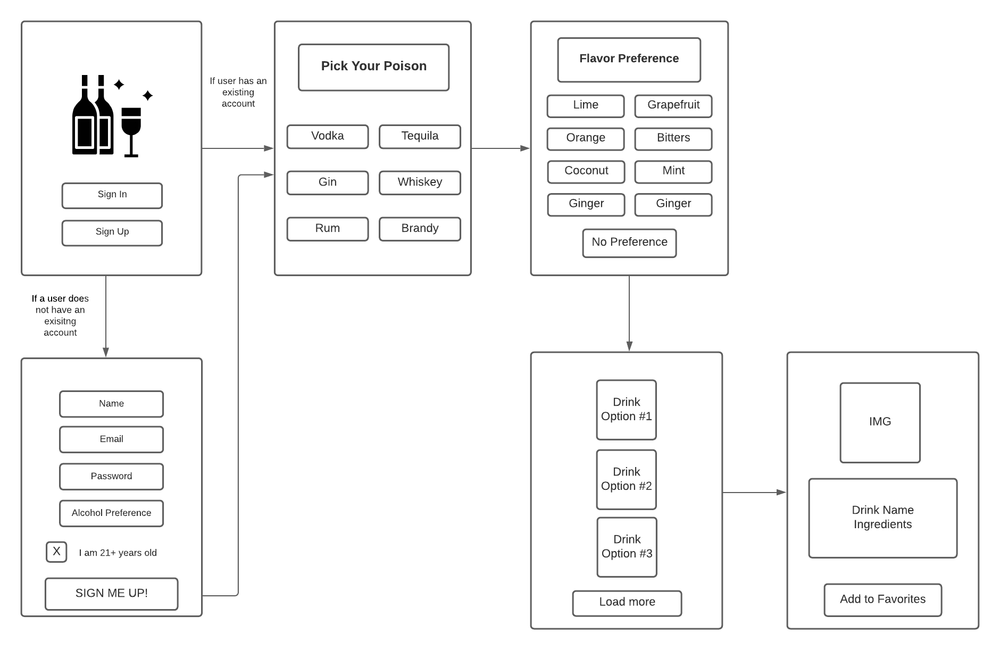

# Give It A Shot

We know all know the feeling: standing in a room full of people, unsure if you belong or what to say. In our case, everyone is ordering fancy cocktails and all you know how to say is "Vodka Soda". Give It A Shot changes all of that.

As fledgling cocktail connoisseurs, we love trying new drinks. But, just like you, we _don't even know what we don't know!_ Through Give It A Shot, we'll be able to try any drink known to the publicly available, [Cocktail DB](https://www.thecocktaildb.com/)

## How It Works

Once logged in, you will be taken to our drink quiz, starting with the type of liquor. You will also be able to specify an ingredient/flavor you like.

From there, Give It A Shot will recommend you 2 brand new drinks! If you don't like those ones, you can always load more.

### Technologies Used

The front end is done completely with **React.js**. Some highlights:

-   React hooks (useState, useEffect)
-   SCSS Modules
-   `window` event listeners for window resizing
-   Fetch API to handle all external APIs, including our own backend and The Cocktail DB API.

The backend uses _Express.js_ on the _Node.js_ runtime. Our database is _PostgreSQL_, using _Sequelize_ as our ORM. Some highlights:

-   Many-to-many drinks - users relationship for "favorites" table
-   `fs` Node module to load images from filesystem into database and backend, via Sequelize seeder.
-   Sequelize seeder to facilitate actual loading of data.
-   `passport` & `bcrypt` Node modules for secure authentication

## Running Locally

Our hosted version of this web app can be found at: _not hosted yet, we need to deploy still :)_

But if you'd like to play with the code yourself, please do the following:
1. Ensure environment variables are set
\- `API_KEY`
2. Local database is created, and is set up with the models provided with this repository, and config is changed to point to your database.
1. `cd give-it-a-shot-image-sql` 2. `createdb give-it-a-shot` 3. Create a config.json:
\-
4. `sequelize db:migrate`
3. Seed the database with Sequelize:
1. `cd give-it-a-shot-api-sql`
2. `sequelize db:seed --seed seeders/20201118201018-image-seeder.js`
4. Dependencies are installed (npm i, both in frontend and backend directories)

## React Component Hierarchy

-   App
    -   Header
    -   Routes
        -   Login
            -   Form
        -   Register
            -   Form
        -   Home
        -   UserProfile
            -   Form
            -   Favorites
        -   Quiz
            -   QuizForm
                -   Option
            -   Results
                -   Option
        -   DrinkDetails
            -   Card (React Bootstrap)

## Project Planning

We used [this Trello board](https://trello.com/b/eroCMlow/mezcalcoholics) to manage our project planning and task completion.

### Entity Relationship Diagram

### Wireframes

## Code Snippets

[Client Side Routing](https://github.com/kelseywhallon/give-it-a-shot/blob/submain/give-it-a-shot-client/src/config/Routes.js)

### Kelsey
1. [Drink Details](give-it-a-shot-client/src/pages/DrinkDetails/DrinkDetails.js)
2. [User CRUD](give-it-a-shot-client/src/pages/UserProfile/UserProfile.js)

### Derek

1.  [images - `fs` module parsing](https://github.com/kelseywhallon/give-it-a-shot/blob/submain/give-it-a-shot-api-sql/data/images.js)
2.  [Option Component](https://github.com/kelseywhallon/give-it-a-shot/blob/submain/give-it-a-shot-client/src/components/Option/Option.js)

## Future Development

-   Bubble up Sequelize errors, like password validation needs to be 8 characters long
-   Implement API calls with Axios, for range of added features: wider browser support, easy to use progress bar, simultaneous requests
-   Only suggest the ingredients that pair with the appropriate liquor, instead of all ingredients
-   Create an Account navigation link, with a drop down for "Account Details" and "Favorites"
-   Redirect user home after registering, instead of logging in
-   Register/Log in errors - none are thrown, the user has no idea what is happenign
-   Use React Contexts to avoid explicitly passing props down
-   Update "Load More" button to use modal
-   Random drink button
